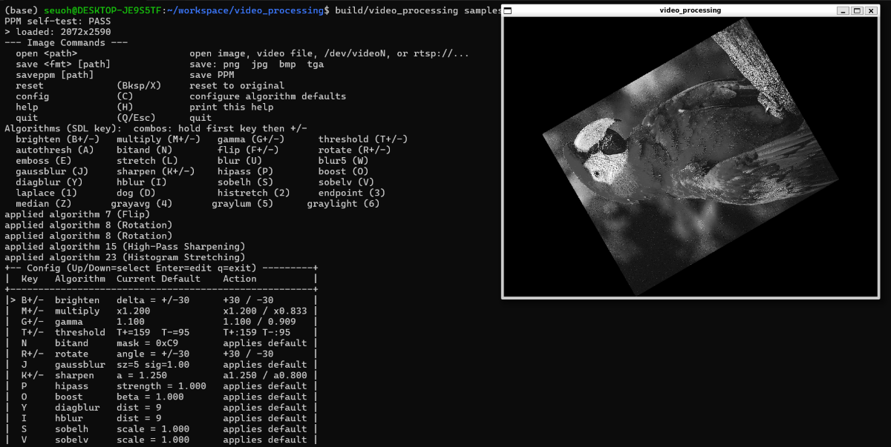

# Video Processing

[English README](assets/README.en.md)

SDL2, OpenGL 3.3 Core Profile, FFmpeg, stb를 사용한 C99 기반 이미지/비디오 처리 프로그램입니다.    
정적 이미지, 영상 파일, 웹캠, RTSP 스트림을 출력할 수 있고, 28개 영상 처리 효과를 적용한 뒤 직접 작성한 GLSL 리샘플링 셰이더로 결과를 표시합니다. 

이 프로젝트는 영상 처리 알고리즘을 프로젝트 내부 C 코드와 GLSL 코드에 직접 구현하는 것을 목표로 합니다.     
외부 라이브러리는 창 생성, 미디어 디코딩, 이미지 파일 입출력, 터미널 입력, OpenGL 접근에만 사용했으며,    
구현 대상인 효과나 리샘플링 필터를 대체하는 용도로 사용하지 않았습니다. 



## 주요 기능

- `stb_image` 기반 정적 이미지 입력과 직접 구현한 PPM P6 파서
- FFmpeg 기반 영상 파일 입력 (`libavformat`, `libavcodec`, `libavutil`, `libswscale`)
- FFmpeg 장치/네트워크 API와 SDL thread 기반 ring buffer를 사용한 웹캠/RTSP 실시간 스트림 입력
- GLSL 우선 효과 처리와 CPU fallback
- 영상/실시간 모드 효과 스택 (`MAX_EFFECT_STACK = 3`)
- 정적 이미지 모드의 직접 CPU 출력 편집과 저장 기능
- 저장 형식: PPM, PNG, JPG, BMP, TGA
- SDL 키보드 단축키와 libedit 기반 터미널 명령 입력, history, Tab completion
- Sobel edge 분류, Bilinear, Bicubic, Lanczos-3, Box filtering을 직접 구현한 OpenGL 하이브리드 리샘플링 표시 경로

## 알고리즘

현재 효과 카탈로그에는 28개 알고리즘이 들어 있습니다.

| 1-7 | 8-14 | 15-21 | 22-28 |
|---|---|---|---|
| 1. Brightness | 8. Rotation | 15. High-Pass Sharpening | 22. Difference of Gaussians |
| 2. Multiply | 9. Emboss | 16. Low-Pass-Removal Sharpening | 23. Histogram Stretching |
| 3. Gamma Correction | 10. Contrast Stretching | 17. Motion Blur Diagonal | 24. Endpoint Detection |
| 4. Threshold Fixed | 11. 3x3 Blur | 18. Motion Blur Horizontal | 25. Median Smoothing |
| 5. Threshold Average | 12. 5x5 Blur | 19. Horizontal Edge | 26. Grayscale Average |
| 6. Bitwise AND | 13. Gaussian Blur | 20. Vertical Edge | 27. Grayscale Luminosity |
| 7. Flip | 14. Sharpen | 21. Laplacian | 28. Grayscale Lightness |

## 요구 사항

- Build tools: C99 compiler, CMake 3.16 이상, Ninja, `pkg-config`
- Libraries: SDL2, OpenGL, FFmpeg (`libavformat`, `libavcodec`, `libavutil`, `libswscale`, `libavdevice`), libedit, math library (`-lm`)
- Header-only dependency: 빌드 전 `third_party/stb/`에 `stb_image.h`, `stb_image_write.h` 다운로드

## 라이선스

작성된 소스 코드는 MIT License로 공개됩니다.

외부 라이브러리는 각 프로젝트의 라이선스를 따르며, 이 저장소는 해당 라이브러리의 소스나 바이너리를 포함하지 않습니다. stb 헤더는 이 저장소에 포함하지 않으며, 빌드 전 `https://github.com/nothings/stb`에서 내려받아 사용합니다.

## 외부 라이브러리

| 컴포넌트 | 용도 | 출처 |
|---|---|---|
| SDL2 | 창 생성, 이벤트 처리, OpenGL context 생성, thread, mutex, condition | https://github.com/libsdl-org/SDL |
| OpenGL | GPU texture, FBO, shader, 최종 렌더링 | https://www.khronos.org/opengl/ |
| FFmpeg | 영상 파일 디코딩, 웹캠/장치 캡처, RTSP/네트워크 스트림 디코딩, RGB 변환 | https://ffmpeg.org/ |
| libedit | 터미널 명령 입력, history, Tab completion | https://thrysoee.dk/editline/ |
| stb_image.h | 정적 이미지 디코딩 | https://github.com/nothings/stb/blob/master/stb_image.h |
| stb_image_write.h | PNG/JPG/BMP/TGA 출력 | https://github.com/nothings/stb/blob/master/stb_image_write.h |

stb 헤더 다운로드:

```bash
mkdir -p third_party/stb
curl -L https://raw.githubusercontent.com/nothings/stb/master/stb_image.h -o third_party/stb/stb_image.h
curl -L https://raw.githubusercontent.com/nothings/stb/master/stb_image_write.h -o third_party/stb/stb_image_write.h
```

이 저장소는 stb 헤더를 포함하지 않으므로, `stb_image.h`와 `stb_image_write.h`의 라이선스 조건은 사용자가 내려받은 원본 헤더의 라이선스 문구를 따릅니다.

## 빌드

```bash
cmake -B build -G Ninja
cmake --build build
```

메인 실행 파일은 다음 위치에 생성됩니다.

```bash
./build/video_processing <image|video|/dev/videoN|rtsp-url>
```

실행 예시:

```bash
./build/video_processing samples/photo.png
./build/video_processing samples/movie.mp4
./build/video_processing /dev/video0
./build/video_processing rtsp://192.168.1.100:554/stream
```

## 조작법

이 프로그램은 SDL 키보드 입력과 터미널 명령을 모두 지원합니다.

공통:

- `H`: 현재 모드의 도움말 출력
- `Q` 또는 `Esc`: 종료
- `C`: 알고리즘 기본 파라미터 설정
- `open <path>`: 다른 이미지, 영상, 웹캠 장치, RTSP URL 열기

이미지 모드:

- `save <png|jpg|bmp|tga> [path]`: 현재 정적 이미지 출력 저장
- `saveppm [path]` 또는 `P`: PPM 저장
- `Backspace` 또는 `X`: 원본 입력으로 reset
- 저장 기능은 정적 이미지 모드에서만 사용할 수 있습니다.

영상 모드:

- `Space`: 재생/일시정지
- `0`-`9`: 0%-90% 위치로 seek
- `Home` / `End`: 시작/끝으로 seek 후 일시정지
- `Left` / `Right`: 일시정지 상태에서 frame step
- `Up` / `Down`: 재생 속도 조절
- `Tab`: loop 토글
- `Backspace` 또는 `X`: 효과 스택 비우기

실시간 모드:

- `Space`: 화면 freeze/resume
- `reconnect` 또는 `P`: 스트림 재연결
- `buffer`: buffer 상태 출력
- `info`: 스트림 정보 출력
- `Backspace` 또는 `X`: 효과 스택 비우기

공통 효과 단축키:

- `B`, `M`, `G`, `T`, `F`, `R`, `K`를 누른 상태에서 `+` 또는 `-`를 누르면 해당 알고리즘의 paired parameter 동작을 실행합니다.
- 단일 키 효과에는 `A`, `E`, `U`, `D`, `Z`, `1`, `2`, `3`, `4`, `5`, `6`이 있습니다.
- 터미널 효과 명령은 `brighten`, `multiply`, `gamma`, `threshold`, `autothresh`, `bitand`, `flip`, `rotate`, `emboss`, `stretch`, `blur`, `blur5`, `gaussblur`, `sharpen`, `hipass`, `boost`, `diagblur`, `hblur`, `sobelh`, `sobelv`, `laplace`, `dog`, `histretch`, `endpoint`, `median`, `grayavg`, `graylum`, `graylight`입니다.

실행 중 `H`를 누르면 현재 source 모드에 맞는 정확한 명령 목록을 볼 수 있습니다.

## 테스트

빌드 후 다음 명령을 실행합니다.

```bash
./build/test_cpu_reference
./build/test_image_saver
SDL_VIDEODRIVER=offscreen ./build/test_glsl_parity
```

GLSL parity test는 SDL이 OpenGL 3.3 context를 만들 수 있는 환경이 필요합니다. Headless 환경에서는 `SDL_VIDEODRIVER=offscreen`을 사용하더라도 driver 지원이 필요할 수 있습니다.

## 프로젝트 구조

```text
include/          
src/              
shaders/          효과와 리샘플링용 GLSL shader
tests/            CPU, image saver, GLSL parity test
third_party/stb/  Local stb header
```
