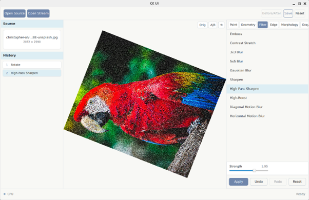

# Qt UI Video Processing

[Korean README](../README.md)

Qt UI Video Processing is a desktop image and video processing interface built with Qt 6 Quick/QML and C++17.

This branch provides a Qt UI version of the original `video_processing` project. It supports image files, video files, and RTSP/RTMP/HTTP stream inputs. In image mode, it also supports saving processed output and undo/redo.



## Features

- Three-panel Qt Quick/QML desktop UI
- Open static images, save processed results, reset, undo, and redo
- OpenCV-based video playback with pause, seek, and frame stepping
- Open RTSP/RTMP/HTTP streams with reconnect and disconnect support
- Direct image editing mode and effect stack support for video/stream mode
- Algorithm browser grouped by Point, Geometry, Filter, Edge, Morphology, and Grayscale
- Per-algorithm parameter controls
- Qt Scene Graph rendering path with an OpenGL-based GPU effect pipeline

## Algorithms

The application provides 28 image/video processing algorithms.

| ID | Algorithm | Category |
|---:|---|---|
| 1 | Brightness | Point |
| 2 | Multiply | Point |
| 3 | Gamma | Point |
| 4 | Fixed Threshold | Point |
| 5 | Average Threshold | Point |
| 6 | Bitwise AND | Point |
| 7 | Flip | Geometry |
| 8 | Rotate | Geometry |
| 9 | Emboss | Filter |
| 10 | Contrast Stretch | Filter |
| 11 | 3x3 Blur | Filter |
| 12 | 5x5 Blur | Filter |
| 13 | Gaussian Blur | Filter |
| 14 | Sharpen | Filter |
| 15 | High-Pass Sharpen | Filter |
| 16 | High-Boost | Filter |
| 17 | Diagonal Motion Blur | Filter |
| 18 | Horizontal Motion Blur | Filter |
| 19 | Horizontal Edge | Edge |
| 20 | Vertical Edge | Edge |
| 21 | Laplacian | Edge |
| 22 | DoG | Edge |
| 23 | Histogram Stretch | Edge |
| 24 | Endpoint Detection | Edge |
| 25 | Median Smoothing | Morphology |
| 26 | Grayscale Average | Grayscale |
| 27 | Grayscale Luminosity | Grayscale |
| 28 | Grayscale Lightness | Grayscale |

## Requirements

- CMake 3.16 or newer
- C++17 compiler
- Qt 6: Core, Gui, Qml, Quick, QuickControls2
- OpenCV: `core`, `imgproc`, `imgcodecs`, `videoio`

## Build

```bash
set -a
source .env
set +a
cmake -B build -G Ninja
cmake --build build --target qt_ui
```

Run:

```bash
./build/qt_ui
```

On WSLg/Wayland, the app can use `QT_UI_WSLG_RUNTIME_DIR`, `QT_UI_QPA_PLATFORM`, and `QT_UI_QSG_RHI_BACKEND` to adjust `XDG_RUNTIME_DIR`, `QT_QPA_PLATFORM`, and `QSG_RHI_BACKEND` at startup.

## Usage

- `Open Image`: open an image file
- `Open Video`: open a video file
- `Open Stream`: open an RTSP/RTMP/HTTP stream URL
- `Save`: save the current image-mode output
- `Reset`: restore the original source state
- Select an algorithm category and algorithm in the right panel, edit parameters, then click `Apply`
- In video mode, use the bottom transport bar for playback, pause, seek, and frame stepping

## Tests

When the local test files are included, run:

```bash
cmake --build build
ctest --test-dir build --output-on-failure
```

GUI-related tests use `QT_QPA_PLATFORM=offscreen` in headless environments.

## Project Structure

```text
include/   C++ public headers and QML-facing types
src/       Qt application, controller, image/video services, processing core
qml/       Qt Quick UI components
tests/     Local unit tests, when included in the checkout
assets/    README images and English documentation
```

## License

The source code is released under the MIT License. See `LICENSE` for details.
